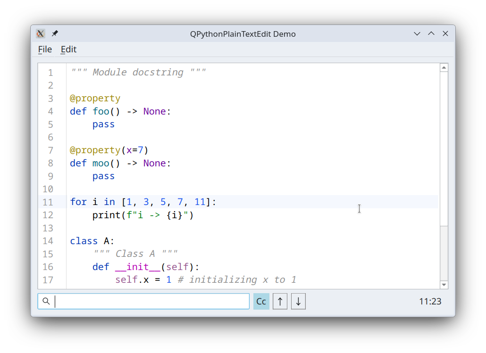

# QPPTE - QPythonPlainTextEdit

An embeddable code editor for Python. 



Written in Python with [PySide6](https://pypi.org/project/PySide6/)
it is created with intent to be used within larger applications where code editor is required. For example 
if you application supports plugins in Python and you want to give users ability to create and edit such plugins 
directly within the application, then you can make this library a dependency in your project and embed this editor.

It supports basic syntax highlighting using [tree-sitter](https://github.com/tree-sitter/py-tree-sitter) and keystrokes common to code editors. The styles and 
the keystrokes can be customized by the user.

To add this library to your project do

```shell
uv add qppte
```

This library includes a small demo application qppte_demo ([example_gui.py](https://github.com/Brainless-Software/qppte/blob/master/src/qppte/example_gui.py))
which you can use to try this editor. To run it do

```shell
uv tool run --from qppte qppte_demo
```

You can use the source for it as example of embedding this code editor within you application.

Source code for _qppte_ is available [here](https://github.com/Brainless-Software/qppte). 

### Links
* [PySide6](https://pypi.org/project/PySide6/)
* [tree-sitter](https://github.com/tree-sitter/py-tree-sitter)
* [example_gui.py](https://github.com/Brainless-Software/qppte/blob/master/src/qppte/example_gui.py) - source for qppte_demo application.